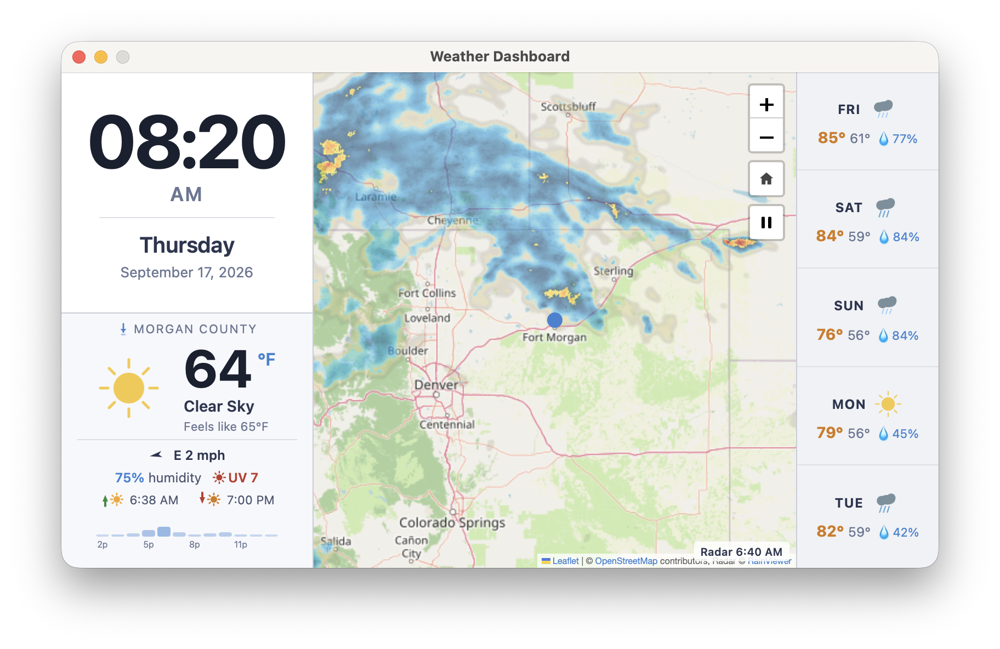

# bob-weather

A fullscreen kiosk-style weather dashboard built with [Neutralino.js](https://neutralino.js.org/), designed for an **800×480** embedded or touchscreen display.



## Features

- **Live clock** — large HH:MM display with AM/PM indicator, day of week, and date
- **Current conditions** — temperature, feels-like, condition, wind, humidity, sunrise/sunset; toggle °F/°C by clicking the unit
- **5-day forecast** — vertical list of daily hi/lo, condition icon, and precipitation probability
- **Map + radar** — OpenStreetMap base tiles with animated RainViewer precipitation radar overlay; zoom 7 default; zoom controls top-right
- All data sources are free with no API keys required (Open-Meteo, RainViewer, OpenStreetMap, Nominatim)

---

## Installation via Homebrew (macOS)

The easiest way to install bob-weather on macOS is through the project's [Homebrew](https://brew.sh) tap.

Because the cask lives in the main project repo (not a dedicated `homebrew-*` repo), you need to pass the full URL when tapping:

```bash
brew tap kdekorte/bob-weather https://github.com/kdekorte/bob-weather.git
brew trust kdekorte/bob-weather
brew install bob-weather
```

> `brew trust` is required because the tap is not hosted in a `homebrew-*` named repository. It marks the tap as trusted so Homebrew will run its cask scripts.

The cask installs `bob-weather.app` directly into `/Applications`.

### First-launch steps

**1. Gatekeeper security warning**

Because the app is ad-hoc signed (not notarised with an Apple Developer certificate), macOS will block it on first open:

1. Try to open the app — macOS will show a security warning
2. Open **System Settings → Privacy & Security**
3. Scroll down and click **Open Anyway**

Alternatively, clear the quarantine flag from the terminal:

```bash
xattr -dr com.apple.quarantine /Applications/bob-weather.app
```

**2. Location permission**

On first launch the app will request access to your location via **System Settings → Privacy & Security → Location Services**. Allow it so the weather and map centre on your actual position. If you decline, the app falls back to any coordinates saved in its config, or Kansas City, MO as a last resort.

> **Upgrading:** `brew upgrade bob-weather`
>
> **Uninstalling:** `brew uninstall bob-weather && brew untap kdekorte/bob-weather`

---

## Prerequisites

| Requirement | Version |
|---|---|
| [Node.js](https://nodejs.org/) | 20 or later |
| [Neutralino CLI](https://neutralino.js.org/docs/cli/neu-cli) | Latest (`npm i -g @neutralinojs/neu`) |

Install or update the CLI:

```bash
npm install -g @neutralinojs/neu
```

---

## Project setup

Clone the repo and download the Neutralino runtime binaries (first time only, or after a version change):

```bash
git clone <repo-url> bob-weather
cd bob-weather
neu update
```

`neu update` downloads the platform binaries into `bin/` and the client library into `resources/vendor/neutralino.js`. These are excluded from version control via `.gitignore`.

---

## Running the app

```bash
neu run
```

This starts the Neutralino dev server and opens the app window. The app reloads automatically when source files change.

### Location

On first launch the app requests geolocation permission from the OS. If permission is denied or unavailable, it falls back to the coordinates set in `neutralino.config.json` under `weatherConfig.latitude` / `weatherConfig.longitude`. If those are also unset, it defaults to Kansas City, MO.

To hardcode a location, edit `neutralino.config.json`:

```json
"weatherConfig": {
  "useGeolocation": false,
  "latitude": 39.7392,
  "longitude": -104.9903
}
```

### Unit toggle

Click the **°F** / **°C** label in the current conditions panel to toggle temperature units. The preference is persisted in `localStorage`.

---

## Debugging

Enable the Chromium DevTools inspector by setting `enableInspector` to `true` in `neutralino.config.json`:

```json
"modes": {
  "window": {
    "enableInspector": true
  }
}
```

Then run `neu run` and right-click anywhere in the window → **Inspect Element**, or the DevTools window will open automatically.

To log messages from the Neutralino native layer:

```json
"logging": {
  "enabled": true,
  "writeToLogFile": true
}
```

Log output goes to `neutralinojs.log` in the project root (excluded from git).

---

## Building a distributable package

```bash
neu build
```

Output is written to `dist/bob-weather/`:

| File | Platform |
|---|---|
| `bob-weather-mac_arm64` | macOS Apple Silicon |
| `bob-weather-linux_x64` | Linux x64 |
| `bob-weather-linux_arm64` | Linux ARM64 |
| `bob-weather-linux_armhf` | Linux ARMhf (e.g. Raspberry Pi) |
| `bob-weather-win_x64.exe` | Windows x64 |
| `resources.neu` | Bundled app resources (required alongside any binary) |

To run a built binary, both the binary and `resources.neu` must be in the same directory:

```bash
cd dist/bob-weather
./bob-weather-mac_arm64        # macOS Apple Silicon
./bob-weather-linux_x64        # Linux
bob-weather-win_x64.exe        # Windows
```

### Targeting a specific platform

`neu build` always produces all platforms. To distribute only the binary for the current machine, copy just the matching binary and `resources.neu` from `dist/bob-weather/`.

> **macOS note:** Only the `mac_arm64` binary is packaged for release and Homebrew distribution. The `mac_x64` and `mac_universal` binaries are built by `neu build` but not used.

---

## Packaging as a macOS Application

Use the included [`package-mac.sh`](package-mac.sh) script to produce a proper macOS `.app` bundle for Apple Silicon.

### Prerequisites

- macOS with `sips` and `iconutil` (included with Xcode Command Line Tools)
- Neutralino CLI installed (`npm i -g @neutralinojs/neu`)
- Binaries downloaded (`neu update`)

### Run the script

```bash
chmod +x package-mac.sh   # first time only
./package-mac.sh
```

### What the script does

1. Runs `neu build` to compile the app and bundle resources
2. Creates a standard `.app` directory structure under `dist/bob-weather.app/`
3. Copies the `mac_arm64` binary into `Contents/MacOS/`
4. Copies `resources.neu` alongside the binary
5. Generates a `.icns` icon from `resources/icons/app.png` using `sips` and `iconutil`
6. Writes a complete `Info.plist` with bundle ID, version, display name, and location usage description

### Output

```
dist/bob-weather.app/
├── Contents/
│   ├── Info.plist
│   ├── MacOS/
│   │   ├── bob-weather          ← executable
│   │   └── resources.neu
│   └── Resources/
│       └── bob-weather.icns
```

### Installing and running

```bash
# Run directly from the project
open dist/bob-weather.app

# Install to Applications
cp -R dist/bob-weather.app /Applications/
```

### Security warning on first launch

macOS Gatekeeper will block an unsigned app. To allow it:

1. Try to open the app — macOS will block it
2. Open **System Settings → Privacy & Security**
3. Scroll to the bottom and click **Open Anyway**

Alternatively, from the terminal:

```bash
xattr -dr com.apple.quarantine dist/bob-weather.app
```

---

## Creating a release

Use [`release.sh`](release.sh) to tag, build, publish, and update the Homebrew formula in one go.

### Prerequisites

- `neu` (Neutralino CLI) — `npm install -g @neutralinojs/neu`
- `gh` (GitHub CLI) — `brew install gh` then `gh auth login`
- macOS with `sips` and `iconutil` (included with Xcode Command Line Tools)

### Commands

| Command | Description |
|---|---|
| `./release.sh` | Show current version and release status |
| `./release.sh tag` | Create and push a git tag for the current version |
| `./release.sh package` | Build the arm64 `.app` bundle and tarball |
| `./release.sh release` | Create GitHub release and upload the tarball |
| `./release.sh formula` | Update the Homebrew formula URL and SHA256 |
| `./release.sh all` | Run all steps in sequence |

### Typical release workflow

```bash
# 1. Bump the version
#    Edit "appVersion" in neutralino.config.json, then commit
vim neutralino.config.json
git add neutralino.config.json
git commit -m "Bump version to 1.1.0"

# 2. Run the full release pipeline
chmod +x release.sh   # first time only
./release.sh all

# 3. Commit the updated cask
git add Casks/bob-weather.rb
git commit -m "Update cask for 1.1.0"
git push
```

`release.sh all` performs these steps automatically:
1. Creates and pushes an annotated git tag (`v<version>`)
2. Runs `neu build` and packages the arm64 `.app` bundle as a `.tar.gz` archive
3. Creates the GitHub release and uploads the tarball
4. Downloads the tarball, computes the SHA256, and rewrites `Casks/bob-weather.rb`

---

## Configuration reference

All runtime configuration lives in `neutralino.config.json` under the `weatherConfig` key:

| Key | Type | Default | Description |
|---|---|---|---|
| `useGeolocation` | bool | `true` | Prefer GPS location over saved coordinates |
| `latitude` | number\|null | `null` | Fallback latitude if geolocation fails or is disabled |
| `longitude` | number\|null | `null` | Fallback longitude if geolocation fails or is disabled |
| `units` | string | `"imperial"` | `"imperial"` (°F, mph) or `"metric"` (°C, kph) |
| `timeFormat` | string | `"12h"` | `"12h"` or `"24h"` |
| `refreshIntervalSeconds` | number | `300` | Weather and radar refresh interval |
| `radarOpacity` | number | `0.6` | Radar overlay opacity (0–1) |
| `radarFrameCount` | number | `2` | Number of radar frames to animate |

Changes to `neutralino.config.json` take effect on the next full app launch.

---

## Project structure

```
bob-weather/
├── neutralino.config.json   # App config and weatherConfig
├── SPEC.md                  # Full feature specification
├── README.md
├── .gitignore
├── bin/                     # Runtime binaries (git-ignored, populated by neu update)
├── dist/                    # Build output (git-ignored)
└── resources/
    ├── index.html           # Root HTML — 3-column layout
    ├── styles/
    │   └── main.css         # All layout and visual styles
    ├── scripts/
    │   ├── config.js        # Reads neutralino.config.json at startup
    │   ├── clock.js         # Live clock panel
    │   ├── weather.js       # Weather fetch and render (Open-Meteo)
    │   └── map.js           # Leaflet map + RainViewer radar
    ├── icons/
    │   └── *.svg            # Weather condition SVG icons
    └── vendor/
        ├── neutralino.js    # Neutralino client library (git-ignored)
        └── leaflet/         # Leaflet 1.9.4 (JS, CSS, marker images)
```

---

## Data sources

| Data | Provider | API key required |
|---|---|---|
| Current weather & forecast | [Open-Meteo](https://open-meteo.com/) | No |
| Reverse geocoding (location name) | [Nominatim / OSM](https://nominatim.openstreetmap.org/) | No |
| Precipitation radar | [RainViewer](https://www.rainviewer.com/api.html) | No |
| Map tiles | [OpenStreetMap](https://www.openstreetmap.org/) | No |

---

## Quitting the app

- **Keyboard**: `Cmd+Q`
- **Menu bar** → **Weather Dashboard** → **Quit Weather Dashboard**
- **Window close button** (title bar ×)
